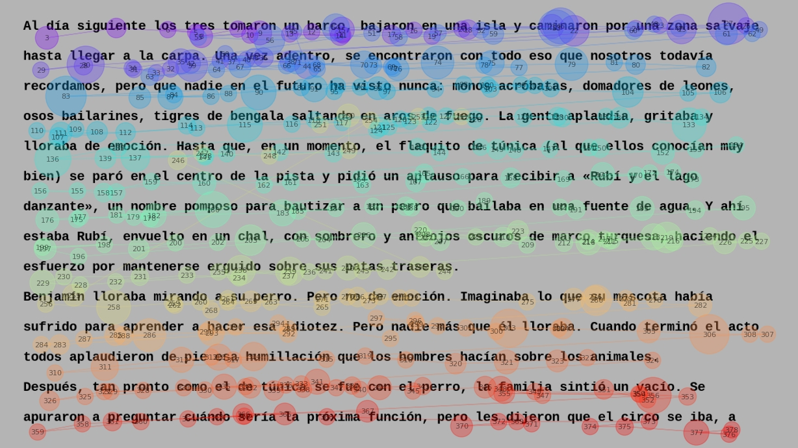

# Eye-tracking during natural reading

## Article
The dataset has now been published: [Cuentos: A Large-Scale Eye-Tracking Reading Corpus on Spanish Narrative Texts. Sci Data (2026)](https://doi.org/10.1038/s41597-026-06798-z)
## About
Eye-tracking is a well-established methodology to study reading processes. Our gaze jumps from word to word, sampling information from text almost sequentially. The time spent on each word, along with patterns of skipping or revisiting, provides proxies for different cognitive processes during comprehension. However, few studies have focused on Spanish, where empirical data remain scarce, and little is known about how findings from other languages translate to Spanish reading behavior. We present the largest publicly available Spanish eye-tracking dataset to date, comprising readings of self-contained stories from 113 native speakers (mean age 23.8; 61 females, 52 males). The dataset includes both long stories (3300 ± 747 words, 11 participants per item on average) and short stories (795 ± 135 words, 50 participants per item on average), providing extensive coverage of natural reading scenarios. This comprehensive resource offers valuable opportunities to investigate eye movement patterns during Spanish reading, explore language-specific cognitive processes, examine Spanish linguistic phenomena, and develop computational algorithms for reading research and natural language processing applications.

## Usage Notes

The code provided is divided in three parts: MATLAB code for the experiment, Python code for visualization and supervised data curation, and Python code for the computation and subsequent analysis of the eye-tracking measures (see [Code](#Code)). The entry point for running the experiment is `run_experiment.m`, although it is primarily left for reference, and there is no guarantee of its correct execution.

To run the Python code, download the dataset from Figshare and place it in the root folder of the git repository. To visualize and/or edit the data, run the script `edit_trial.py`. If you wish to inspect the raw data, remove the ‘*processed’* folder from the ‘*data’* directory. To compute and analyse the eye-tracking measures, run the script `em_analysis.py`.

The necessary packages can be installed via *pip* using the `requirements.txt` file. Linear Mixed Models analysis is performed using the *pymer* package, which requires having R installed (see the package installation notes for further instructions).

## Definitions
A *word* is defined as a sequence of characters between two blank spaces, except those characters that correspond to punctuation signs.
 - *Unfrequent word*: its number of appearances in the latinamerican subtitles database from [EsPal](https://www.bcbl.eu/databases/espal/) is less or equal to 100.
 - *Short sentence*: less or equal to 5 words.
 - *Long sentence*: greater or equal to 30 words.
 - *Long word*: greater or equal to 10 chars.
 - *Unfrequent characters*: ¿; ?; ¡; !; “; ”; —; «; (; ).

## Corpus
Twenty and ten self-contained short (avg. 795 (± 135), min. 680, max. 1220 words) and long (avg. 3300 (± 147), min. 1975, max. 4640 words) stories written in Latin American Spanish were selected. From the twenty short stories, five were extracted from online Argentinian blog posts, and the other fifteen were extracted from “100 covers de cuentos clásicos” (Casciari, 2021). These constitute classic stories that were simplified, translated (if needed) and re-written in Spanish by Hernán Casciari. The goal was to obtain diversity in literary style while maintaining both difficulty and slang constant. The long stories were extracted from diverse sources and were selected mainly due to their use in other eye-tracking during reading experiments.

### Selection criteria
- Minimize dialogue.
- Minimize short and long sentences.
- Minimize unfrequent words and characters.
- Self-contained.
- No written dates.
- Not shorter than four hundred words.
- Not longer than two thousand words.

There is a correlation between *minimizing dialogues* and *minimizing unfrequent characters*, as dialogues are usually characterized by such.
## Methodology
* Stimuli creation for the short stories (see ```metadata/stimuli_config.mat```):
    * Resolution: 1080x1920
    * Font: Courier New. Size: 24. Color: black.
    * Background color: grey.
    * Linespacing: 55px.
    * Max lines per screen: 14.
    * Max chars per line: 99.
    * Left margin: 280px.
    * Top margin: 185px.
* Stimuli creation for the long stories:
    * Resolution: 768x1020
    * Font: Courier New. Size: 18. Color: black.
    * Background color: grey.
    * Linespacing: 50px.
    * Max lines per screen: 10.
    * Max chars per line: 99.
    * Left margin: 150px.
    * Top margin: 120px.
* The participant is told that, after reading each text, he/she will be evaluated with three comprehensive questions.
* Their reading skills are also inquired (short-stories only).
* Items are ordered pseudo-randomly for each participant, ensuring a similar number of trials per story.
* Once an item has been read, comprehension questions are answered.
* Additionally, unique common nouns are displayed (one by one) and the participant is asked to write the first word that comes to mind (short-stories only).
* The following item is displayed by pressing a button.
* Each item is a *block*. After each block, a one-minute break and eye-tracker calibration follows.
* Eye-tracker calibration is validated by the presentation of points positioned in the corners of where stimuli is displayed.

## Code

### Experiment
The experiment is coded in MATLAB 2015a using the Psychophysics Toolbox (http://psychtoolbox.org/). It is launched by running ```run_experiment.m```.
### Data processing
Data processing was carried out entirely in Python 3.10. Necessary packages are listed in ```requirements.txt```. There are four distinct steps:
1. **Data extraction:** Raw EDF data was converted to ASCII using EDF2ASC version 4.2.762.0 Linux from the EyeLink Display Software. 
2. **Data cleaning:** Trials were manually inspected, where horizontal lines are drawn for delimiting text lines and fixations were corrected when needed (```edit_trial.py```). Very short (50ms) and very long (1000ms) fixations were discarded in this step.
3. **Fixation assignment:** Fixations were assigned to words, using blank spaces as delimiters (```scripts/data_processing/assign_fixations.py```). Return sweeps were discarded in this step.
4. **Measures extraction:** Eye-tracking measures (early, intermediate and late) were computed for each word, except the first and last words of each line or those following or preceding punctuation marks (```scripts/data_processing/extract_measures.py```). The measures were:
    * **Early measures:** First fixation duration (FFD); single fixation duration (SFD); first pass reading time/gaze duration (FPRT); likelihood of skipping (LS).
    * **Intermediate measures:** Regression path duration (RPD); regression rate (RR).
    * **Late measures:** Total fixation duration (TFD); re-reading time (RRT); second pass reading time (SPRT); fixation count (FC); regression count (RC).
### Data analysis
Data analysis consists of printing overall stats per trial, plotting several early measures as a function of known effects (i.e., word length and frequency) and performing mixed effects models analysis with such fixed effects (```em_analysis.py```). To run the Linear Mixed Models analysis, R must be installed with the following packages: *lme4*, *lmerTest*, and *emmeans* (see [pymer4 installation](http://eshinjolly.com/pymer4/installation.html)).

This script also takes care of steps 3 and 4 of data processing by calling the corresponding functions from the aforementioned files.

## Processed Scanpath Pipeline for BETO / ACL-GazeSupervisedLM

This repository now also contains a lightweight export pipeline used to connect the reading corpus with the BETO gaze-supervised language-model experiments in `ACL-GazeSupervisedLM`.

The goal of this added pipeline is to expose processed scanpaths in formats that can be consumed directly by the BETO training and debugging steps.

Inside `tesis_LIAA`, this `reading-et` directory is kept as a vendored project folder rather than as an external Git reference. To keep the parent repository lightweight, the large processed alignment outputs are versioned as compressed archives under `artifacts/` instead of as extracted folders.

### New scripts

- `build_scanpaths_from_trials.py`
  - reconstructs one fixation-aligned scanpath per subject and story from processed trials,
  - writes:
    - `data/processed/words_fixations/<story>/<subject>.pkl`
    - `data/processed/scanpaths/<story>/<subject>.json`

- `build_scanpath_alignment.py`
  - aligns segmented scanpath text files with the full story text and exact global word ids,
  - writes:
    - `aligned_output/aligned_scanpaths.jsonl`
    - `aligned_output/alignment_summary.json`
    - `aligned_output/alignment_issues.jsonl`
    - `results_all_alligned/<story>/<subject>.json`

- `export_scanpaths_table.py`
  - flattens scanpath JSON files into CSV tables for inspection or external analysis.

### Why these outputs matter

Two processed outputs are particularly important for the BETO pipeline:

- `results_all_alligned/`
  - this mirrored structure contains one JSON file per story and participant,
  - these files were used as direct inputs in the debugging and smoke-training stages corresponding to steps 4, 5, and 6 in `ACL-GazeSupervisedLM`.

- `aligned_output/aligned_scanpaths.jsonl`
  - this is the consolidated aligned dataset used by the larger BETO pretraining pipeline, especially the canonical `step7b` training run.

In other words:

- `step4/5/6` in the language-model repo used per-subject aligned JSON files from `results_all_alligned/`
- `step7b` used the consolidated JSONL file from `aligned_output/`

### Typical workflow

1. Compute or recover processed trial-level scanpaths:

```bash
python build_scanpaths_from_trials.py
```

2. Build text/scanpath alignment outputs for the BETO pipeline:

```bash
python build_scanpath_alignment.py --results_dir results_all --stimuli_dir stimuli --output_dir aligned_output --mirrored_output_dir results_all_alligned --full_scanpaths_dir data/processed/scanpaths
```

3. Optionally export flat CSV tables:

```bash
python export_scanpaths_table.py --scanpaths-dir data/processed/scanpaths
```

### Versioned artifacts for reproducibility

To preserve compatibility with the current BETO experiments while keeping `tesis_LIAA` reasonably lightweight, the vendored copy versions compact archives:

- `artifacts/aligned_output.zip`
- `artifacts/results_all_alligned.zip`

After cloning `tesis_LIAA`, extract them in place before running the BETO steps:

```powershell
Expand-Archive -LiteralPath .\reading-et\artifacts\aligned_output.zip -DestinationPath .\reading-et -Force
Expand-Archive -LiteralPath .\reading-et\artifacts\results_all_alligned.zip -DestinationPath .\reading-et -Force
```

After extraction, the expected paths are again:

- `aligned_output/aligned_scanpaths.jsonl`
- `aligned_output/alignment_summary.json`
- `aligned_output/alignment_issues.jsonl`
- `results_all_alligned/<story>/<subject>.json`

The extracted directories are ignored locally, so the repository keeps tracking only the compact archives. These outputs are not raw eyetracking recordings. They are processed alignment artifacts required to reproduce the current BETO scanpath-supervised language-model pipeline across repositories.

## How to cite us
If you make use of the data or source code, please provide the appropriate citation:
```
@article{travi_cuentos_2026,
	title = {Cuentos: {A} {Large}-{Scale} {Eye}-{Tracking} {Reading} {Corpus} on {Spanish} {Narrative} {Texts}},
	copyright = {2026 The Author(s)},
	issn = {2052-4463},
	shorttitle = {Cuentos},
	url = {https://www.nature.com/articles/s41597-026-06798-z},
	doi = {10.1038/s41597-026-06798-z},
	language = {en},
	urldate = {2026-02-18},
	journal = {Scientific Data},
	publisher = {Nature Publishing Group},
	author = {Travi, Fermin and Bianchi, Bruno and Slezak, Diego Fernandez and Kamienkowski, Juan E.},
	month = feb,
	year = {2026},
	keywords = {Computational neuroscience, Language},
}
```
